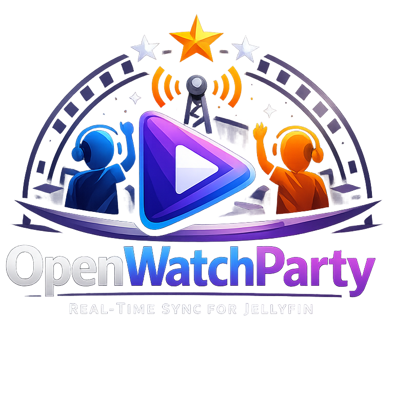

<p align="center">
  
</p>

<p align="center">
  <strong>Watch movies together, no matter the distance.</strong>
</p>

<p align="center">
  <a href="#-quick-start">Quick Start</a> •
  <a href="#-features">Features</a> •
  <a href="docs/">Documentation</a> •
  <a href="#-contributing">Contributing</a>
</p>

<p align="center">
  
  
  
</p>

---

OpenWatchParty is a **Jellyfin plugin** that synchronizes video playback across multiple viewers in real-time. Host a watch party, invite your friends, and enjoy movies together — perfectly in sync, frame by frame.

## ✨ Features

| | Feature | Description |
|---|---------|-------------|
| 🎬 | **Real-time Sync** | Play, pause, and seek — everyone stays together |
| 🏠 | **Room System** | Create or join watch parties with a single click |
| ⚡ | **Low Latency** | Sub-200ms synchronization with drift correction |
| 🔒 | **Optional Auth** | JWT-based authentication for private sessions |
| 🎨 | **Native UI** | Seamlessly integrated into Jellyfin's interface |
| 🐳 | **Easy Deploy** | Docker-ready, runs anywhere |

## 🚀 Quick Start

Get OpenWatchParty running in under 5 minutes.

### Prerequisites

- [Docker](https://docs.docker.com/get-docker/) and Docker Compose
- A running Jellyfin server (10.8+)

### Step 1: Start the Session Server

The session server handles real-time synchronization between viewers.

```bash
# Clone the repository
git clone https://github.com/mhbxyz/OpenWatchParty.git
cd OpenWatchParty

# Start the session server
docker compose -f infra/docker/docker-compose.yml up -d session-server
```

Verify it's running:
```bash
curl http://localhost:3000/health
# Should return: OK
```

### Step 2: Install the Plugin

1. **Download** the latest `OpenWatchParty.dll` from [Releases](https://github.com/mhbxyz/OpenWatchParty/releases)

2. **Copy** to your Jellyfin plugins folder:
   ```bash
   # Linux
   sudo cp OpenWatchParty.dll /var/lib/jellyfin/plugins/OpenWatchParty/

   # Docker
   docker cp OpenWatchParty.dll jellyfin:/config/plugins/OpenWatchParty/
   ```

3. **Restart** Jellyfin:
   ```bash
   sudo systemctl restart jellyfin
   # or
   docker restart jellyfin
   ```

### Step 3: Enable the Client Script

Since Jellyfin 10.9+, plugins can't auto-inject scripts. Enable it manually:

1. Go to **Dashboard** → **General**
2. Scroll to **Custom HTML** (Branding section)
3. Add this line:
   ```html
   <script src="/web/plugins/openwatchparty/plugin.js"></script>
   ```
4. Click **Save**
5. **Hard refresh** your browser (`Ctrl+F5`)

### Step 4: Start Watching Together!

1. **Play any video** in Jellyfin
2. **Click the Watch Party button** (group icon in the header)
3. **Create a room** and share the room name with friends
4. **Friends join** by clicking the same button and selecting your room

That's it! When you play, pause, or seek — everyone follows along.

---

## 🎮 Usage

### As a Host

```
1. Start playing a video
2. Click the Watch Party icon 🎬
3. Enter a room name → "Start Room"
4. Share the room name with friends
5. You control playback for everyone!
```

### As a Guest

```
1. Click the Watch Party icon 🎬
2. Find the room in the list → "Join"
3. The video loads automatically
4. Sit back and enjoy — you're synced!
```

## 🔧 Configuration

### Plugin Settings

Access via **Dashboard** → **Plugins** → **OpenWatchParty**:

| Setting | Description |
|---------|-------------|
| **JWT Secret** | Enable authentication (min 32 chars) |
| **Session Server URL** | Custom server URL (default: `ws://host:3000/ws`) |

### Session Server

Configure via environment variables:

```bash
docker run -d \
  -p 3000:3000 \
  -e ALLOWED_ORIGINS="https://your-jellyfin.com" \
  -e JWT_SECRET="your-32-char-secret" \
  openwatchparty-session-server
```

## 🏗️ Architecture

```
┌─────────────────┐     ┌─────────────────┐     ┌─────────────────┐
│   Your Browser  │     │  Session Server │     │ Friend's Browser│
│   (Host)        │◄───►│     (Rust)      │◄───►│   (Guest)       │
└─────────────────┘     └─────────────────┘     └─────────────────┘
         │                      │                       │
         │         WebSocket Sync Messages              │
         └──────────────────────┴───────────────────────┘
```

- **Jellyfin Plugin** (C#) — Serves the client script and handles config
- **Session Server** (Rust) — Manages rooms and relays sync messages
- **Web Client** (JavaScript) — UI and playback synchronization

## 📚 Documentation

| Section | Description |
|---------|-------------|
| [Installation](docs/operations/installation.md) | Detailed setup guide |
| [Configuration](docs/operations/configuration.md) | All configuration options |
| [Security](docs/operations/security.md) | JWT auth and hardening |
| [Troubleshooting](docs/operations/troubleshooting.md) | Common issues and fixes |
| [Architecture](docs/technical/architecture.md) | How it works under the hood |
| [Protocol](docs/technical/protocol.md) | WebSocket message spec |

## 🤝 Contributing

Contributions are welcome! Whether it's:

- 🐛 Bug reports
- 💡 Feature suggestions
- 📝 Documentation improvements
- 🔧 Pull requests

See the [Contributing Guide](docs/development/contributing.md) to get started.

## 📄 License

MIT License — do whatever you want, just keep the license.

---

<p align="center">
  <strong>Made for movie nights, long-distance relationships, and friends who miss watching together.</strong>
</p>

<p align="center">
  ⭐ Star this repo if you find it useful!
</p>
